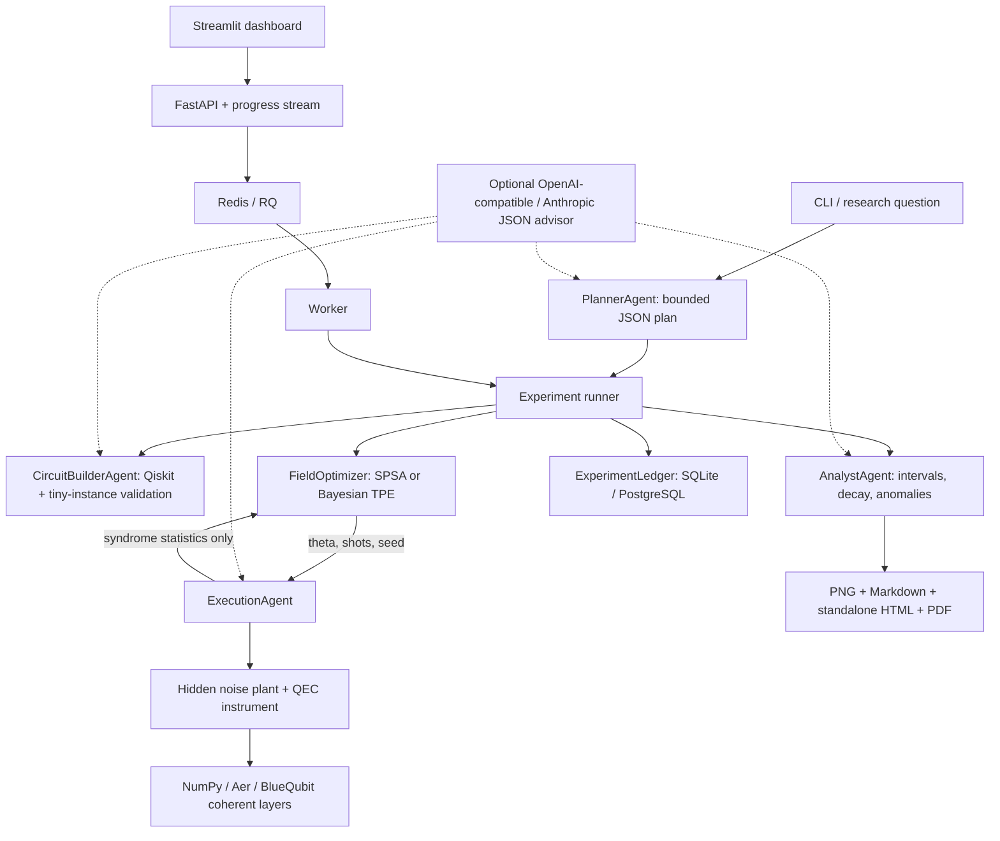

# vfqec — Virtual-Field Quantum Error Correction

A runnable research lab for learning per-qubit compensation rotations from **measured
syndrome statistics only**. It compares an unencoded memory, ordinary QEC, gate-wise
Pauli twirling, a field calibrated once, an adaptively calibrated field, and an oracle.
All six methods appear in every experiment's logical-error figure.

This is a phenomenological simulation, not a claim of a new fault-tolerant threshold or
hardware performance. It includes real numerical results, an API/worker/dashboard stack,
and explicit execution provenance. No API key is needed for local experiments.

## Quickstart

Python 3.11–3.13, or Docker with Compose v2.24+:

```bash
cp .env.example .env
# When building from a Git checkout:
export VFQEC_GIT_COMMIT="$(git rev-parse HEAD)"
docker compose up --build -d
```

Open the dashboard at <http://localhost:8501> and API documentation at
<http://localhost:8000/docs>. Services bind only to loopback. The dashboard defaults to
a small smoke run; uncheck that option for the preset's full settings.

Run the full 60-round E1 in the Compose environment:

```bash
docker compose run --rm worker vfqec run E1 --backend local
```

For a native installation:

```bash
python3.11 -m venv .venv
. .venv/bin/activate
python -m pip install -r requirements.lock -e '.[dev]'
vfqec run E1 --backend local
vfqec ledger
vfqec report RUN_ID
```

On this delivered workspace, `.venv` already contains a tested Python environment.
Full source contents are provided in `DELIVERY.md` beside this README.

Generated artifacts are under `results/RUN_ID/`. Compose uses a named `results` volume;
access exports through the dashboard or `/runs/RUN_ID/artifacts/report.pdf`.

## What is actually simulated

| Code | Physical model | Recovery | Logical memory readout |
|---|---|---|---|
| Repetition N=3…5 | Exact NumPy density matrix, or Aer coherent layers | Minimum-weight syndrome lookup | Ideal final data decode; majority for odd N |
| Repetition N=6…9 | Exact state-vector evolution with sampled noise/measurements | Same lookup | Same final decode |
| Rotated surface d=3 | Nine data qubits with eight ideal extraction ancillas eliminated analytically; explicit 17-qubit Qiskit extraction circuit is exported | CSS PyMatching spatial MWPM | Ideal terminal readout decoded in X or Z basis |

For repetition memory, `basis=Z` protects against X rotations and stochastic X errors;
`basis=X` protects against Z rotations and stochastic Z errors. Unsupported simultaneous
axes/ZZ on repetition are rejected, not silently treated as protected. Use the surface
code for simultaneous X and Z fields, uniform depolarizing Pauli noise, and nearest-neighbor
ZZ crosstalk. Even N uses a fixed minimum-weight tie rule; it is not an odd-distance code.
Surface d=5/MPS scaling is optional in the brief and is **not implemented**.

For each data qubit, the ordered coherent gates are
`Rx(eps_x) → Rz(eps_z) → Rz(-theta_z) → Rx(-theta_x)`, followed by optional neighboring
`Rzz(zz)` gates and stochastic Pauli noise with total probability `p`. A QEC round then
measures all stabilizers, flips each reported bit independently with probability `q`,
and applies the decoder's Pauli correction. State preparation, extraction gates, recovery
gates and terminal data readout are otherwise ideal.

Drift on each active axis is
`eps_i(t) = eps_i(0) + amplitude*sin(2*pi*t/period) + slope*t`.
The surface model uses horizontal and vertical nearest neighbors on the 3×3 data grid.
The unencoded comparator uses **data qubit 0's field**, the same p, and no two-qubit ZZ term.

The surface decoder is **spatial per round**, not a spacetime decoder. Nonzero q is fully
simulated but this decoder does not exploit syndrome history. These experiments are
not a circuit-level, fault-tolerant surface-code threshold benchmark. The simulator
maintains states across rounds: it does not substitute independent logical flip rates
or a binomial approximation for coherent memory dynamics.

An oracle cancels the single-qubit fields exactly in the specified gate ordering.
It cannot cancel ZZ with single-qubit controls, and is not a proven global optimum
when correlated noise remains. Repetition codes do not protect both quantum error axes.
One X- or Z-memory experiment is not full logical process tomography; run both surface
memory bases to investigate both components.

## Syndrome-only learning and budgets

`FieldOptimizer` receives only an observation function `(theta, shots, seed) ->
(cost, shots, checks)`. It cannot access a plant configuration, logical readouts, exact
probabilities or true fields through this interface. The execution service encapsulates
those quantities. This is an architectural boundary, not a security sandbox against
malicious Python introspection. The fixed optimizer is numerical, not LLM-generated code.

The cost is the observed fraction of stabilizer bits equal to one. A total of `shots`
independent probe circuits is divided among prefixes of length 1…`window`; only each
probe's endpoint syndrome contributes. Mid-circuit syndromes perform recovery. This
makes the short-window cost a finite-shot measurement rather than access to exact
probabilities. Fresh probes start in the code space.

SPSA uses two perturbed evaluations plus one monitored candidate per iteration, followed
by averaging the second half of the candidate trajectory. Controls stay in [-0.7, 0.7]
radians; the landscape is periodic and syndrome-only optima need not be globally unique.
Optuna's seeded TPE sampler provides the Bayesian option. Improvement is measured, not
assumed. The analyst flags failed convergence and bad exponential fits.

The calibrated and adaptive methods share their initial calibration. Adaptive control
relearns at rounds K, 2K, … using independent probes and the previous learned field as
a warm start. Calibration freezes simulated memory time; latency, calibration-induced
memory aging, and hardware wall-clock drift are not modeled. Learning and evaluation
use distinct recorded seeds. True fields are added to diagnostics only after learning.

`shots=4000` in E1 means **4000 total shots per cost evaluation**, not 4000 total for the
entire experiment. E1 defaults to 50 SPSA iterations, a two-round window, 4000 evaluation
shots, and K=20. The upfront shot bound counts all calibration shots plus six methods ×
rounds × endpoint shots. The density engine integrates the noise ensemble exactly and
samples readouts; the trajectory engine reuses paths for efficiency. Consequently,
endpoints at different rounds are correlated. Per-point Wilson intervals are shown;
fit covariance is not presented as independent-round uncertainty. Zero observed errors
are not proof of zero physical error.

## Experiments and CLI

```bash
vfqec run E1 --backend local                   # 3 qubits; eps=(.12,-.08,.15), p=.002, 60 rounds
vfqec run E1 --backend aer --quick             # Aer smoke run
vfqec run E1 --optimizer bayes                 # Seeded Optuna TPE
vfqec run E2 --backend local                   # Surface d=3, X/Z fields and ZZ
vfqec run E2 --basis X --backend local          # Complementary surface-memory basis
vfqec run E3 --backend local                   # N=3,5,7 × p=.001,.005,.02
vfqec run E4 --backend local                   # K=5,15,30 × 500,2000 calibration shots
vfqec sweep examples/plan.json
vfqec plan 'Compare noise regions' --max-shots 20000000 --output plan.json
vfqec hardware-template                       # Export E5; submit nothing
```

`--quick` explicitly changes rounds, shots and iterations; it is not a reproduction of
E1 defaults. E3 and E4 are complete sweeps in the CLI and single configurations in the
dashboard. A sweep plan is JSON with `runs`, an aggregate `max_shots`, and (for cloud
runs) an aggregate `max_credits`. Each run accepts the fields in `config.py`; unknown
fields are rejected. Use `--config settings.json` to override q, ZZ, drift, distance,
window and other parameters. Explicit CLI flags take precedence. For phase repetition,
use `{"basis":"X","eps_x":[0],"eps_z":[0.12,-0.08,0.15]}`.

E3 computes adjacent-distance suppression factors only where both observed errors are
nonzero. An exploratory finite-size crossing fit is attempted only when three distances,
three noise points and an actual crossing are available. Otherwise it reports that the
threshold is unidentifiable. E4 exposes calibration shots, cadence and memory failures.
Exponential memory fits are descriptive: coherent oscillations and drift can invalidate
them. Rerun requests are stored in `analysis.reruns`; they never silently spend beyond
the requested budget. Increase the budget and rerun explicitly if needed.

E5 is disabled by default and exports an unsubmitted 3-qubit GHZ preparation/readout
smoke template. It is a starting point for provider-specific hardware validation, not
an executed QEC hardware experiment. `vfqec run E5` refuses to submit hardware work.

## Architecture



Agent advice is validated and cannot overwrite numerical results. Planner-generated
configurations are validated against schema and budget; saturated previous points can
be pruned through `PlannerAgent.plan(..., past=...)`. No-key mode uses deterministic
rules. To enable an advisor, set `LLM_PROVIDER=openai-compatible` (or `anthropic`),
`LLM_API_KEY` and an explicit `LLM_MODEL`. Set `LLM_BASE_URL` for a compatible provider.
Field values and optimizer queries are never sent to the LLM. Provider failure or
invalid JSON falls back to rules, recording the advisor mode without secret-bearing
HTTP response bodies. LLM token costs are separate from QEC shot/cloud budgets.

The ledger stores configuration, source commit (including a dirty marker), seeds,
optimizer observations, progress, failures, backend labels, provider job IDs and result
JSON. SQLite is the native default; Compose supplies PostgreSQL. Secrets are read from
environment variables and excluded from configuration, logs and version control.

## BlueQubit execution — read this distinction

Install is included in the pinned dependencies. Put your token in `.env` or export it:

```bash
export BLUEQUBIT_API_TOKEN='YOUR_TOKEN'
vfqec run E1 --backend bluequbit --device cpu --max-credits 10 --max-remote-jobs 1000
```

Or with Compose after filling `.env`:

```bash
docker compose run --rm worker vfqec run E1 --backend bluequbit --device cpu
```

Devices are `cpu`, `gpu`, `mps.cpu`, and `mps.gpu`. The adapter submits real Qiskit
circuits through the BlueQubit SDK. It obtains a coherent layer's unitary from a Choi
state on twice the number of data qubits, then performs stochastic noise, finite-shot
syndrome measurement, and classical recovery locally. The report therefore labels it
**“BlueQubit … coherent simulation + local noise/syndrome/recovery.”** It does not claim
that the entire repeated QEC circuit ran remotely or that cloud simulation is hardware.
The optimizer still sees only finite-shot syndromes, never a statevector or unitary.

Identical layers are deduplicated within a run. Every accepted job ID is persisted
before polling; transient polling failures retry the same ID. An ambiguous submission
is not blindly resubmitted, because that could incur duplicate charges. Existing remote
matrices are cached on disk. Provider simulator randomness is not seed-controlled here;
remote unitary evolution is deterministic, and all local sampling seeds are recorded.

A job-count cap and **estimated USD credit** cap are checked before submissions. Provider
estimates are not guaranteed final bills. The SDK documents estimates for CPU/GPU;
MPS selection is implemented but will fail closed if the provider cannot quote a cost.
MPS truncation that destroys unitarity is rejected. This implementation materializes
a dense data-unitary and is not a scalable d=5 MPS QEC simulator. Remote integration
requires an account/token and was not executed in the included local validation.

Official interfaces used:
[BlueQubit SDK](https://app.bluequbit.io/sdk-docs/bluequbit.sdk.html),
[Qiskit Aer](https://qiskit.github.io/qiskit-aer/stubs/qiskit_aer.AerSimulator.html),
[PyMatching](https://pymatching.readthedocs.io/en/stable/).

## API and services

- `POST /runs`: validated Config JSON → queued run ID.
- `GET /runs`: ledger summary.
- `GET /runs/{id}`: status, configuration, results.
- `GET /runs/{id}/events?after=0`: server-sent progress events.
- `GET /runs/{id}/progress?after=0`: polling equivalent.
- `GET /runs/{id}/artifacts/{filename}`: reports, figures, JSON, QASM.
- `GET /health`: database and Redis availability.

`api`, `worker`, `dashboard`, `db`, and `redis` have health checks. Python services run
as UID 10001. Redis, PostgreSQL and artifacts use persistent named volumes. The optional
`gpu` profile requires Linux x86_64, NVIDIA drivers and NVIDIA Container Toolkit:

```bash
docker compose --profile gpu up --build -d db redis api dashboard worker-gpu
docker compose stop worker
```

Submit runs with `backend=aer`; the GPU worker uses `AER_DEVICE=GPU`. Aer stabilizer
execution is exposed by `AerBackend('stabilizer').run_counts(...)` for Clifford circuits;
arbitrary coherent rotations are rejected rather than approximated as Clifford noise.
Large-code Aer propagation uses Aer's unitary engine, while small-code propagation uses
its density-matrix engine. Gate-wise twirled layers use the common exact NumPy
channel implementation. All noise and recovery remain in the common instrument.

## Verification and included results

```bash
ruff check .
ruff format --check .
pytest -q
docker build --target runtime -t vfqec:local .
```

CI runs lint, tests, a smoke experiment and a Docker build. Scientific tests cover
zero-noise repetition memories N=3…9 in both bases, exact oracle cancellation, the
syndrome-cost minimum, all 27 single-Pauli surface errors, surface preparation and
recovery, noisy density/trajectory agreement, NumPy/Aer agreement, and the BlueQubit
SDK contract with an explicitly simulated test double. The test double is not a cloud
validation. Tests also check budgets, deterministic optimization, reports, the ledger,
and API artifact/stream behavior.

The included E1 results were generated by this program with seed 1729. After 60 rounds,
the original verified run observed 22/4000 failures for standard QEC, 16/4000 for twirling,
and 2/4000 for each learned/oracle method. Initial learned theta was approximately
(0.12835, -0.08867, 0.14367) radians versus the evaluation-only true field
(0.12, -0.08, 0.15). The unencoded memory showed coherent oscillations and was flagged
as unsuitable for a simple exponential fit. These observations belong to one seed and
model; they are not constants used by the simulator. See the delivered example report
and result JSON for all six methods, intervals, configurations and actual provenance.
