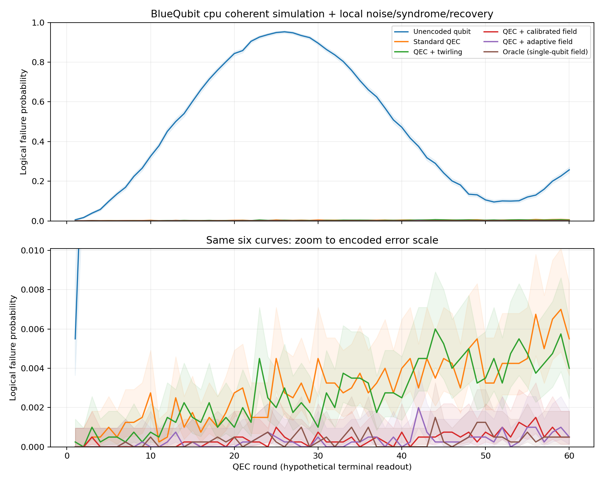
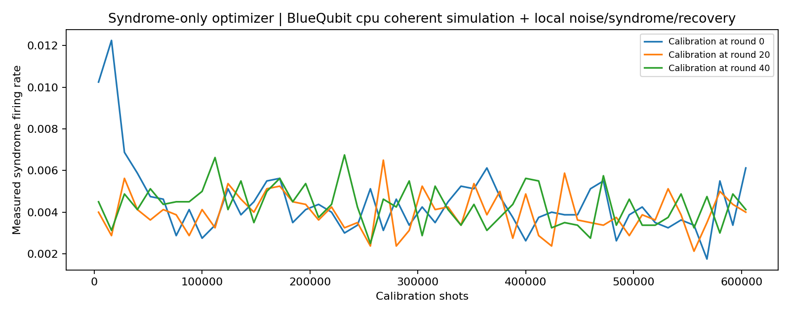
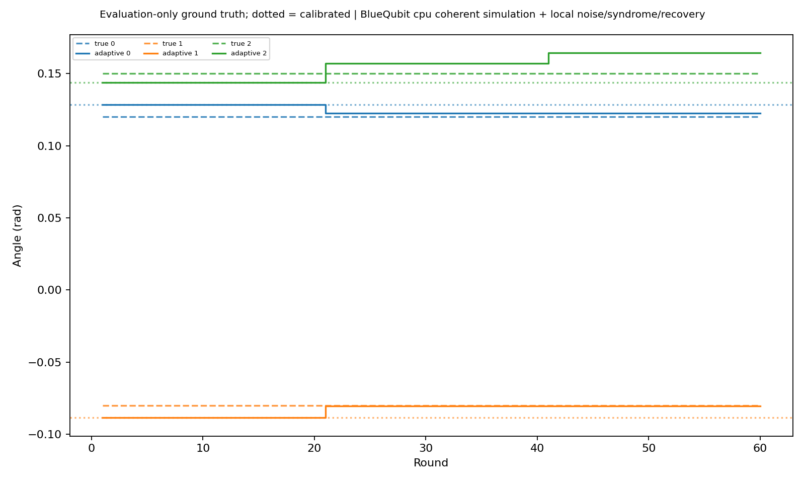

# VFQEC E1 - aca95affb4e946598029f8c307c01b80

Backend: **BlueQubit cpu coherent simulation + local noise/syndrome/recovery**

Seed: 1729; source: `f2f026c2021c444a2a36edd1972eb47c77148676`; shots charged to budget: 3252000

| Method | Final error | 95% interval | Fitted / round |
|---|---|---|---|
| Unencoded qubit | 0.25725 | [0.2439, 0.271] | 0.0873256 |
| Standard QEC | 0.0055 | [0.003635, 0.008314] | 9.4078e-05 |
| QEC + twirling | 0.004 | [0.002464, 0.006488] | 8.59271e-05 |
| QEC + calibrated field | 0.0005 | [0.0001371, 0.001821] | 1.26067e-05 |
| QEC + adaptive field | 0.0005 | [0.0001371, 0.001821] | 1.02507e-05 |
| Oracle (single-qubit field) | 0.0005 | [0.0001371, 0.001821] | 9.9054e-06 |

- Phenomenological data noise; ideal gates, preparation and terminal readout.
- Spatial decoding each round; q>0 is not fault-tolerant spacetime decoding.
- Calibration uses fresh encoded probes; drift time freezes during calibration.
- Oracle cancels single-qubit fields only; ZZ and stochastic noise remain.
- Endpoint curves share simulated trajectories and have correlated time points.
- Zero observed failures have nonzero confidence upper bounds.
- Rates are descriptive; coherent/drifting noise need not be exponential. No fit covariance is interpreted as independent-round uncertainty.
- unencoded: exponential model poorly describes coherent/drifting memory





## Configuration
```json
{
  "experiment": "E1",
  "code": "repetition",
  "distance": 3,
  "basis": "Z",
  "p": 0.002,
  "q": 0.0,
  "eps_x": [
    0.12,
    -0.08,
    0.15
  ],
  "eps_z": [
    0.0
  ],
  "zz": 0.0,
  "drift_amplitude": 0.0,
  "drift_period": 60.0,
  "drift_slope": 0.0,
  "rounds": 60,
  "shots": 4000,
  "evaluation_shots": 4000,
  "window": 2,
  "iterations": 50,
  "cadence": 20,
  "optimizer": "spsa",
  "seed": 1729,
  "backend": "bluequbit",
  "device": "cpu",
  "aer_method": "density_matrix",
  "max_shots": 20000000,
  "max_remote_jobs": 1000,
  "max_credits": 10.0,
  "batch_size": 256
}
```